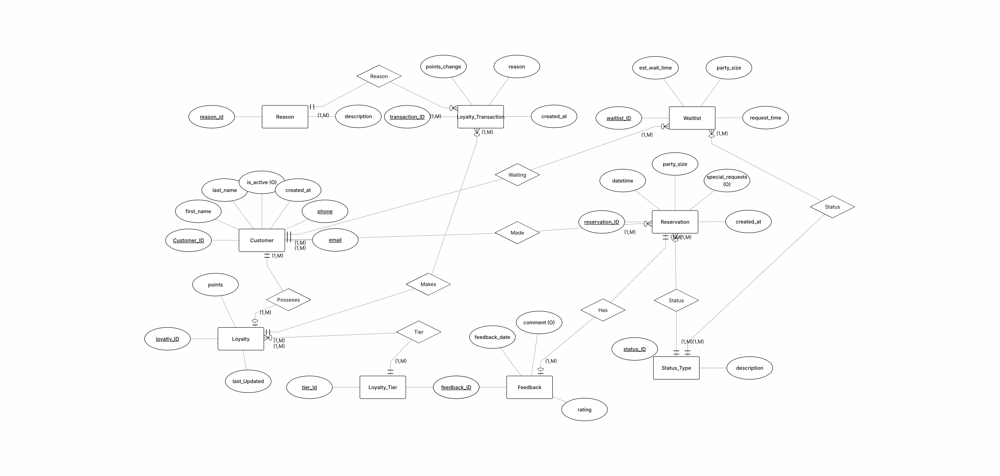
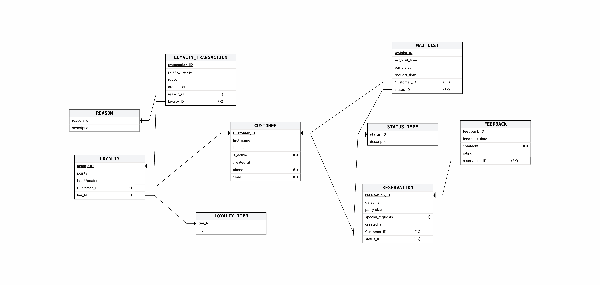
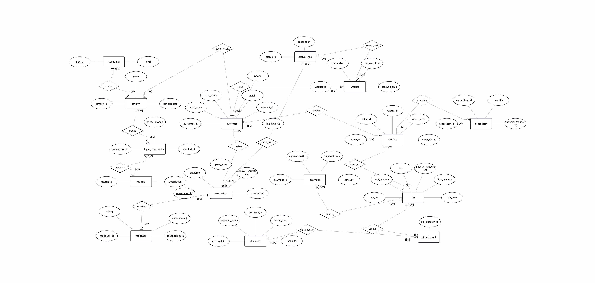
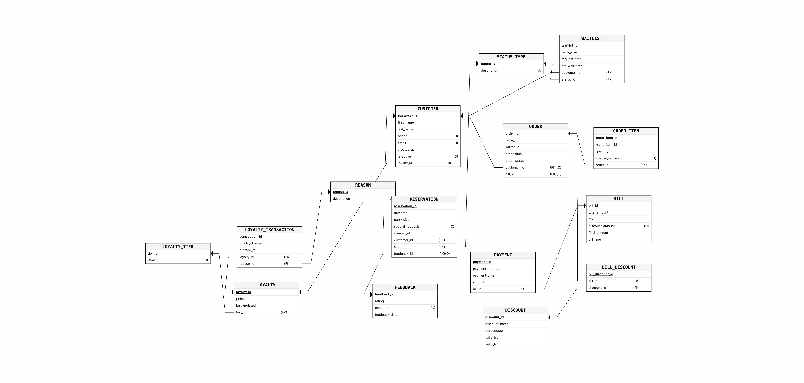

# DB_5786_0000 — Restaurant Order & Billing Database

📘 Project Report
This project is a restaurant order and billing database management system. It was developed as part of a database course project.

---

## 🧑‍💻 Authors

* Dylan Athouel
* David Sperling

---

## 🏢 Project Scope

* **System:** Restaurant Management System
* **Unit:** Order & Billing Department

---

## 📌 Table of Contents

### 🔵 Stage 1
1. [Overview](#-overview)
2. [Application Mockup (UI)](#-application-mockup-ui)
3. [ERD and DSD Diagrams](#-erd-and-dsd-diagrams)
4. [Data Structure Description](#-data-structure-description)
5. [Data Insertion Methods](#-data-insertion-methods)
6. [Backup & Restore](#-backup--restore)
7. [Docker Setup](#-docker-setup-postgresql)
8. [Getting Started](#-getting-started-python-app)

### 🟠 Stage 2
9. [SELECT Queries — Dual Form (JOIN vs Subquery)](#-select-queries--dual-form-join-vs-subquery)
10. [SELECT Queries — Additional](#-select-queries--additional)
11. [UPDATE Queries](#-update-queries)
12. [DELETE Queries](#-delete-queries)
13. [Constraints (CHECK)](#-constraints-check)
14. [Backup & Restore — Stage 2](#-stage-2--backup--restore-verification)
15. [Transactions — ROLLBACK & COMMIT](#-transactions--rollback--commit)

### 🔗 Stage 3
16. [Stage 3 – Integration and Views](#-stage-3--integration-and-views)
    - [ERD and DSD Diagrams (Stage 3)](#-erd-and-dsd-diagrams-1)
    - [Reverse-Engineering Algorithm](#-reverse-engineering-algorithm-dsd--erd)
    - [Integration Decisions](#-integration-decisions)
    - [Integration Process and SQL Commands](#-integration-process-and-sql-commands)
    - [Views and Analytical Queries](#-views-and-analytical-queries)
    - [Stage 3 Conclusion](#-stage-3--conclusion)

### 🟢 Stage 4
17. [Stage 4 – PL/pgSQL Programs](#-stage-4--plpgsql-programs)
    - [Schema Changes (AlterTable.sql)](#-schema-changes-altertablesql)
    - [Function 1 – `get_top_loyalty_customers` (REF CURSOR)](#-function-1--get_top_loyalty_customers-ref-cursor)
    - [Function 2 – `calculate_period_revenue`](#-function-2--calculate_period_revenue)
    - [Procedure 1 – `apply_loyalty_tier_discount`](#-procedure-1--apply_loyalty_tier_discount)
    - [Procedure 2 – `generate_monthly_waiter_report`](#-procedure-2--generate_monthly_waiter_report)
    - [Trigger 1 – `validate_payment_amount` (BEFORE INSERT/UPDATE)](#-trigger-1--validate_payment_amount-before-insertupdate)
    - [Trigger 2 – `award_loyalty_points_on_bill_update` (AFTER UPDATE)](#-trigger-2--award_loyalty_points_on_bill_update-after-update)
    - [Main Program 1 – Loyalty Reward Workflow](#-main-program-1--loyalty-reward-workflow-f1--p1)
    - [Main Program 2 – Monthly Revenue Workflow](#-main-program-2--monthly-revenue-workflow-f2--p2)
    - [PL/pgSQL Elements Coverage Matrix](#-plpgsql-elements-coverage-matrix)
    - [Stage 4 Conclusion](#-stage-4--conclusion)

---

## 🧾 Overview

This database system is designed to manage the operational and financial activities of a restaurant. It includes data about orders, order items, bills, payments, discounts, and billing history.

The system uses foreign keys, weak entities, and entity relationships to maintain data consistency and avoid redundancy.

---

## 💻 Application Mockup (UI)

The screenshots below represent a **UI mockup** of what the application layer could look like, designed to illustrate the real-world use case of the database.

### Login


### Dashboard


### Orders & Billing


### Menu Management


### Staff & Tables


---

## 📁 ERD and DSD Diagrams

### ERD


### DSD


---

## 📋 Data Structure Description

Below is a summary of the main entities and their fields:

### ORDER
Stores customer orders.
* `order_id` (Primary Key)
* `table_id`
* `customer_id`
* `waiter_id`
* `order_time`
* `order_status`

### BILL
The bill generated per order.
* `bill_id` (Primary Key)
* `order_id` (Foreign Key)
* `total_amount`
* `tax`
* `discount_amount`
* `bill_time`


### PAYMENT
Payment record linked to a bill.
* `payment_id` (Primary Key)
* `bill_id` (Foreign Key)
* `payment_method`
* `payment_time`
* `amount`


### DISCOUNT
Available discounts.
* `discount_id` (Primary Key)
* `discount_name`
* `percentage`
* `valid_from`
* `valid_to`


### BILL_DISCOUNT
Junction table linking bills to applied discounts.
* `bill_discount_id` (Primary Key)
* `bill_id` (Foreign Key)
* `discount_id` (Foreign Key)

---

## 📥 Data Insertion Methods

### ✅ Method A: Python Script

Data for the `BILL_DISCOUNT` junction table was generated using a custom Python script that produces 20,000 INSERT statements into a `.sql` file.


### ✅ Method B: Mockaroo Generator

Tables such as `ORDER`,`PAYMENT`, and `DISCOUNT` were populated using [Mockaroo](https://mockaroo.com/), a tool that generates realistic mock data in SQL format.


### ✅ Method C: Mockaroo Generator CSV

Tables `BILL` was populated using [Mockaroo](https://mockaroo.com/), a tool that generates realistic mock data in CSV format.


---

## 💾 Backup & Restore

### Backup

A full backup of the `restaurant_db` database was performed using pgAdmin.


### Restore

The backup was successfully restored into a test database to verify data integrity.


---

# 🟠 Stage 2 — Queries, Constraints & Transactions

---

## 🔍 SELECT Queries — Dual Form (JOIN vs Subquery)

For each of the following 4 queries, two equivalent versions are provided:
- **Version A** using an explicit `JOIN`
- **Version B** using a `Subquery`

Both return the same result, but differ in readability and execution efficiency.

---

### Query 1 — Orders with Bill & Payment Details

> Retrieves each order along with its total bill amount, tax, and payment method, ordered by total amount descending.

**🎯 Business Context:** A restaurant manager wants to review all orders with their financial details and payment method in a single view — useful for end-of-day reconciliation and detecting unpaid or high-value orders.


**Version A — Using JOIN**
```sql
SELECT o.order_id, o.order_status, o.order_time,
       b.total_amount, b.tax, p.payment_method
FROM "ORDER" o
JOIN BILL b ON o.order_id = b.order_id
JOIN PAYMENT p ON b.bill_id = p.bill_id
ORDER BY b.total_amount DESC;
```


---

**Version B — Using Correlated Subqueries**
```sql
SELECT o.order_id, o.order_status, o.order_time,
       (SELECT b.total_amount FROM BILL b WHERE b.order_id = o.order_id) AS total_amount,
       (SELECT b.tax FROM BILL b WHERE b.order_id = o.order_id) AS tax,
       (SELECT p.payment_method FROM PAYMENT p
        JOIN BILL b ON p.bill_id = b.bill_id
        WHERE b.order_id = o.order_id LIMIT 1) AS payment_method
FROM "ORDER" o
ORDER BY total_amount DESC;
```


---

> **📊 Efficiency Comparison:**
> Version A (JOIN) is significantly more efficient. The query planner executes a **single pass** over the joined tables and can leverage indexes on foreign keys. Version B (Correlated Subquery) executes **one subquery per row** of the outer `ORDER` table, resulting in O(n) additional queries — this becomes very costly as data grows. For 500 orders, Version B may execute over 1,500 subqueries internally. **JOIN is the preferred approach in production.**

---

### Query 2 — Bills with Applied Discounts & Savings

> Retrieves each bill along with the applied discount name, percentage, and the actual amount saved, ordered by savings descending.

**🎯 Business Context:** The accounting team needs to track how much revenue is lost to discounts and which promotions are most costly — essential for evaluating the profitability of discount campaigns.

**Version A — Using JOIN**
```sql
SELECT b.bill_id, b.total_amount,
       d.discount_name, d.percentage,
       ROUND(b.total_amount * d.percentage / 100, 2) AS amount_saved
FROM BILL b
JOIN BILL_DISCOUNT bd ON b.bill_id = bd.bill_id
JOIN DISCOUNT d ON bd.discount_id = d.discount_id
ORDER BY amount_saved DESC;
```


---

**Version B — Using Subquery**
```sql
SELECT b.bill_id, b.total_amount,
       d.discount_name, d.percentage,
       ROUND(b.total_amount * d.percentage / 100, 2) AS amount_saved
FROM BILL b, BILL_DISCOUNT bd, DISCOUNT d
WHERE EXISTS (
    SELECT 1 FROM BILL_DISCOUNT bd2
    WHERE bd2.bill_id = b.bill_id AND bd2.discount_id = d.discount_id
)
AND bd.bill_id = b.bill_id AND bd.discount_id = d.discount_id
ORDER BY amount_saved DESC;
```


---

> **📊 Efficiency Comparison:**
> Version A (JOIN) is more efficient here as well, because the three-table join is handled in a single execution plan. PostgreSQL's optimizer can use the junction table `BILL_DISCOUNT` efficiently with indexed foreign keys. Version B using subqueries would require nested lookups for each bill, increasing execution time significantly on large datasets. **JOIN is preferred for multi-table relationships.**

---

### Query 3 — Waiter Performance by Month

> Retrieves each waiter's total number of orders and total revenue generated, grouped by month and year.

**🎯 Business Context:** The restaurant owner wants to evaluate each waiter's productivity and revenue contribution per month — useful for performance reviews, bonuses, and scheduling decisions.

**Version A — Using JOIN**
```sql
SELECT o.waiter_id,
       EXTRACT(YEAR FROM o.order_time) AS year,
       EXTRACT(MONTH FROM o.order_time) AS month,
       COUNT(o.order_id) AS total_orders,
       SUM(b.total_amount) AS total_revenue
FROM "ORDER" o
JOIN BILL b ON o.order_id = b.order_id
GROUP BY o.waiter_id, EXTRACT(YEAR FROM o.order_time), EXTRACT(MONTH FROM o.order_time)
ORDER BY year, month, total_orders DESC;
```


---

**Version B — Using Subquery (Derived Table)**
```sql
SELECT waiter_id, year, month,
       COUNT(*) AS total_orders,
       SUM(total_amount) AS total_revenue
FROM (
    SELECT o.waiter_id, o.order_id,
           EXTRACT(YEAR FROM o.order_time) AS year,
           EXTRACT(MONTH FROM o.order_time) AS month,
           b.total_amount
    FROM "ORDER" o
    JOIN BILL b ON o.order_id = b.order_id
) AS sub
GROUP BY waiter_id, year, month
ORDER BY year, month, total_orders DESC;
```


---

> **📊 Efficiency Comparison:**
> Both versions produce identical results and have similar execution plans — the subquery in Version B is a **derived table** (non-correlated), which PostgreSQL inlines and optimizes similarly to a JOIN. However, Version A is slightly more readable and avoids the extra subquery layer. For analytical queries like this one, the difference is minimal, but **Version A (direct JOIN) is cleaner and equally efficient.**

---

### Query 4 — Payment Method Statistics by Month

> Retrieves payment method usage count and total amount paid, grouped by method, year, and month.

**🎯 Business Context:** The finance team wants to understand customer payment preferences over time — useful for deciding whether to invest in new payment terminals or negotiate lower card processing fees.

**Version A — Using JOIN**
```sql
SELECT p.payment_method,
       EXTRACT(YEAR FROM p.payment_time) AS year,
       EXTRACT(MONTH FROM p.payment_time) AS month,
       COUNT(p.payment_id) AS usage_count,
       SUM(p.amount) AS total_paid
FROM PAYMENT p
JOIN BILL b ON p.bill_id = b.bill_id
GROUP BY p.payment_method, EXTRACT(YEAR FROM p.payment_time), EXTRACT(MONTH FROM p.payment_time)
ORDER BY year, month, usage_count DESC;
```


---

**Version B — Using Subquery (WHERE IN)**
```sql
SELECT payment_method, year, month,
       COUNT(*) AS usage_count,
       SUM(amount) AS total_paid
FROM (
    SELECT p.payment_method, p.amount,
           EXTRACT(YEAR FROM p.payment_time) AS year,
           EXTRACT(MONTH FROM p.payment_time) AS month
    FROM PAYMENT p
    WHERE p.bill_id IN (SELECT bill_id FROM BILL)
) AS sub
GROUP BY payment_method, year, month
ORDER BY year, month, usage_count DESC;
```


---

> **📊 Efficiency Comparison:**
> Version A (JOIN) is more efficient. The `WHERE bill_id IN (SELECT ...)` in Version B forces PostgreSQL to first evaluate the full subquery and build a hash set of all `bill_id` values before filtering. While PostgreSQL often optimizes this into a semi-join internally, it adds overhead compared to a direct JOIN, especially on large tables. **Version A is preferred for both clarity and performance.**

---

## 🔍 SELECT Queries — Additional

The following 4 queries each demonstrate a specific analytical use case for the restaurant database.

---

### Query 5 — Orders Containing Special Requests

> Retrieves all order items that include a special request (e.g., "No salt", "Gluten free"), joined with their parent order details, sorted by most recent order.

**🎯 Business Context:** The kitchen manager needs to monitor special dietary requests (allergies, preferences) to ensure staff are prepared and no requests are missed during service.

```sql
SELECT o.order_id, o.order_time, o.order_status,
       oi.menu_item_id, oi.quantity, oi.special_request
FROM "ORDER" o
JOIN ORDER_ITEM oi ON o.order_id = oi.order_id
WHERE oi.special_request IS NOT NULL
ORDER BY o.order_time DESC;
```


---

### Query 6 — Daily Revenue Report

> Aggregates the number of bills, total revenue, and total tax collected per day, sorted from most recent to oldest.

**🎯 Business Context:** Management needs a daily summary of revenue and tax collected to track business performance over time and compare busy vs slow days.

```sql
SELECT EXTRACT(DAY FROM b.bill_time) AS day,
       EXTRACT(MONTH FROM b.bill_time) AS month,
       EXTRACT(YEAR FROM b.bill_time) AS year,
       COUNT(b.bill_id) AS nb_bills,
       SUM(b.total_amount) AS daily_revenue,
       SUM(b.tax) AS daily_tax
FROM BILL b
GROUP BY EXTRACT(YEAR FROM b.bill_time),
         EXTRACT(MONTH FROM b.bill_time),
         EXTRACT(DAY FROM b.bill_time)
ORDER BY year DESC, month DESC, day DESC;
```


---

### Query 7 — Cancelled Orders with Their Items

> Retrieves all order items belonging to cancelled orders, including the waiter, menu item, quantity, and date, sorted by most recent.

**🎯 Business Context:** Operations needs to investigate cancelled orders to identify patterns — for example, a specific waiter or time slot with high cancellation rates that may indicate a service problem.

```sql
SELECT o.order_id, o.order_time, o.waiter_id,
       oi.menu_item_id, oi.quantity,
       EXTRACT(YEAR FROM o.order_time) AS annee,
       EXTRACT(MONTH FROM o.order_time) AS mois
FROM "ORDER" o
JOIN ORDER_ITEM oi ON o.order_id = oi.order_id
WHERE o.order_status = 'Cancelled'
ORDER BY o.order_time DESC;
```


---

### Query 8 — Discounts Ranked by Percentage with Duration

> Lists all discounts sorted by percentage descending, with a computed column showing the number of days each discount is valid.

**🎯 Business Context:** The marketing team wants to review all active and past discounts ranked by their value — useful for auditing promotions and identifying overly generous discounts that hurt margins.

```sql
SELECT d.discount_id, d.discount_name, d.percentage,
       d.valid_from, d.valid_to,
       (d.valid_to - d.valid_from) AS duree_jours
FROM DISCOUNT d
ORDER BY d.percentage DESC;
```


---

## ✏️ UPDATE Queries

For each UPDATE query, the state of the database **before** and **after** the operation is shown.

---

### UPDATE 1 — Set Stale "In Progress" Orders to "Cancelled"

> All orders with status `In Progress` placed more than 2 years ago are automatically set to `Cancelled`.
```sql
UPDATE "ORDER"
SET order_status = 'Cancelled'
WHERE order_status = 'In Progress'
  AND order_time < NOW() - INTERVAL '2 years'
RETURNING *;
```

**Before:**


**After:**


---

### UPDATE 2 — Shift All Order Times by +1 Day

> All order timestamps are incremented by one day. This query demonstrates a bulk date update with `RETURNING *` to immediately visualize the changes.
```sql
UPDATE "ORDER"
SET order_time = order_time + INTERVAL '1 day'
RETURNING *;
```

**Before:**


**After (RETURNING \*):**


---

### UPDATE 3 — Extend All Discount Validity by 1 Month

> All discount expiration dates (`valid_to`) are extended by one month. Useful to bulk-renew active promotions.
```sql
UPDATE DISCOUNT
SET valid_to = valid_to + INTERVAL '1 month'
RETURNING *;
```

**Before:**


**After (RETURNING \*):**


---

## 🗑️ DELETE Queries

For each DELETE query, the state of the relevant table **before** and **after** the operation is shown.

---

### DELETE 1 — Remove Payments Under 5€ (Data Entry Errors)

> Payments with an amount less than 5€ are considered data entry errors and are removed from the `PAYMENT` table.
```sql
DELETE FROM PAYMENT
WHERE amount < 5;
```

**Before:**


**After:**


---

### DELETE 2 — Remove Discounts Expired More Than 1 Year Ago

> Discounts whose `valid_to` date is more than one year in the past are cleaned up from the `DISCOUNT` table.
```sql
DELETE FROM DISCOUNT
WHERE valid_to < CURRENT_DATE - INTERVAL '1 year';
```

**Before:**


**After:**


---

### DELETE 3 — Remove Cancelled Orders With No Associated Bill

> Cancelled orders that never generated a bill are orphaned records. This query removes them to keep the database clean.
```sql
DELETE FROM "ORDER"
WHERE order_status = 'Cancelled'
  AND order_id NOT IN (SELECT order_id FROM BILL);
```

**Before:**


**After:**


---

## 🔒 Constraints (CHECK)

The following `CHECK` constraints were added to the database using `ALTER TABLE` to enforce data integrity rules. Each section demonstrates the constraint violation with an intentional bad `INSERT`.

---

### Constraint 1 — Tax Must Be Non-Negative (`BILL` table)

> **ALTER TABLE change:** A `CHECK` constraint named `check_tax` was added to the `BILL` table to ensure that the `tax` column cannot contain negative values.
```sql
ALTER TABLE BILL ADD CONSTRAINT check_tax CHECK (tax >= 0);
```

**Violation test — inserting a negative tax:**
```sql
INSERT INTO BILL (bill_id, order_id, total_amount, tax, discount_amount, final_amount, bill_time)
VALUES (999, 1, 50.00, -5.00, 0, 45.00, CURRENT_TIMESTAMP);
```


> ❌ The database correctly rejects the insertion with: `ERROR: new row for relation "bill" violates check constraint "check_tax"`

---

### Constraint 2 — Payment Amount Must Be Positive (`PAYMENT` table)

> **ALTER TABLE change:** A `CHECK` constraint named `check_payment_amount` was added to the `PAYMENT` table to ensure that the `amount` column must be strictly greater than zero.
```sql
ALTER TABLE PAYMENT ADD CONSTRAINT check_payment_amount CHECK (amount > 0);
```

**Violation test — inserting a zero amount:**
```sql
INSERT INTO PAYMENT (payment_id, bill_id, payment_method, payment_time, amount)
VALUES (999, 1, 'Cash', CURRENT_TIMESTAMP, 0);
```


> ❌ The database correctly rejects the insertion with: `ERROR: new row for relation "payment" violates check constraint "check_payment_amount"`

---

### Constraint 3 — Discount Percentage Must Be Between 0 and 100 (`DISCOUNT` table)

> **ALTER TABLE change:** A `CHECK` constraint named `check_percentage` was added to the `DISCOUNT` table to prevent discount percentages above 100% or below 0%.
```sql
ALTER TABLE DISCOUNT ADD CONSTRAINT check_percentage CHECK (percentage BETWEEN 0 AND 100);
```

**Violation test — inserting a percentage of 150:**
```sql
INSERT INTO DISCOUNT (discount_id, discount_name, percentage, valid_from, valid_to)
VALUES (999, 'Super Promo', 150.00, '2025-01-01', '2025-12-31');
```


> ❌ The database correctly rejects the insertion with: `ERROR: new row for relation "discount" violates check constraint "check_percentage"`

---

## 💾 Stage 2 — Backup & Restore Verification

A new backup of the `restaurant_db` database was performed after all Stage 2 operations (queries, updates, deletes, constraints) to ensure data integrity is preserved.

The pgAdmin job history confirms both the **Backup** and **Restore** operations completed successfully.


---

## 🔄 Transactions — ROLLBACK & COMMIT

---

### ROLLBACK Example — Undoing a Bulk Discount Update

> This transaction demonstrates the `ROLLBACK` mechanism. A bulk update sets `discount_amount = 10.00` for all bills. The transaction is then rolled back, restoring the original values.
```sql
-- Step 1: View initial state
SELECT bill_id, total_amount, tax, discount_amount FROM BILL;

BEGIN;

-- Step 2: Update all bills — set discount to 10.00
UPDATE BILL
SET discount_amount = 10.00
RETURNING *;

-- Step 3: View state after update
SELECT bill_id, total_amount, tax, discount_amount FROM BILL;

-- Step 4: Cancel the update
ROLLBACK;

-- Step 5: View state after rollback (original values restored)
SELECT bill_id, total_amount, tax, discount_amount FROM BILL;
```

**State after UPDATE (before ROLLBACK) — all discount_amount = 10.00:**


**State after ROLLBACK — original values restored:**


---

### COMMIT Example — Permanently Extending Discount Validity

> This transaction demonstrates the `COMMIT` mechanism. A bulk update extends all discount `valid_to` dates by 1 month. The transaction is then committed, making the changes permanent.
```sql
-- Step 1: View initial state
SELECT discount_id, discount_name, percentage, valid_to FROM DISCOUNT;

BEGIN;

-- Step 2: Extend all discounts by 1 month
UPDATE DISCOUNT
SET valid_to = valid_to + INTERVAL '1 month'
RETURNING *;

-- Step 3: View state after update
SELECT discount_id, discount_name, percentage, valid_to FROM DISCOUNT;

-- Step 4: Confirm permanently
COMMIT;

-- Step 5: View state after commit (changes are permanent)
SELECT discount_id, discount_name, percentage, valid_to FROM DISCOUNT;
```

**Initial state — before transaction:**


**Final state — after COMMIT (valid_to extended by 1 month):**


## 🐳 Docker Setup (PostgreSQL)

### Prerequisites
- [Docker Desktop](https://www.docker.com/products/docker-desktop/) installed and running

### 1. Create your `.env` file

```env
POSTGRES_DB=restaurant_db
POSTGRES_USER=admin
POSTGRES_PASSWORD=admin123
POSTGRES_HOST=localhost
POSTGRES_PORT=5432
```

### 2. Start the database

```bash
docker-compose up -d
```

### 3. Verify the container is running

```bash
docker ps
```

### 4. Connect to the database

```bash
docker exec -it restaurant_db psql -U admin -d restaurant_db
```

### 5. Stop the database

```bash
docker-compose down          # stop (keeps data)
docker-compose down -v       # stop + delete all data
```

---

## 🚀 Getting Started (Python App)

1. **Clone the repository**
   ```bash
   git clone <repository-url>
   cd DB_5786_0000
   ```

2. **Start the database**
   ```bash
   docker-compose up -d
   ```

3. **Set up the Python environment**
   ```bash
   python -m venv venv
   source venv/bin/activate      # macOS / Linux
   # venv\Scripts\activate       # Windows
   pip install -r requirements.txt
   ```

4. **Run the application**
   ```bash
   python main.py
   ```

---

## ⚙️ Technologies

- **Database**: PostgreSQL 16 (via Docker)
- **Container**: Docker / Docker Compose
- **Application Layer**: Python
- **Mock Data**: Mockaroo, Python script
- **Version Control**: Git

---

<br><br>

# 🔗 Stage 3 – Integration and Views

📜 This stage focuses on integrating the **Order & Billing Department** database with the **Customer / Reservations / Loyalty Department** database — a crucial component of the overall restaurant management system. The objective is to build a unified structure that enables a comprehensive view of customer-related information, combining both transactional (orders, bills, payments) and relational (reservations, loyalty, feedback) data.

As part of this integration, SQL views were created from both the perspective of our department and the collaborating department, plus a third integrated view crossing both worlds. These views provide streamlined, role-specific access to the combined data, making it easier for each side to retrieve and analyze the information most relevant to their operational needs.

---

## 📜 ERD and DSD Diagrams

### ERD (Order & Billing — our department)


### DSD (Order & Billing — our department)


### ERD (Customer / Reservations / Loyalty — imported department)


### DSD (Customer / Reservations / Loyalty — imported department)


### ERD (Integration)


### DSD (Integration)


---

## 🔄 Reverse-Engineering Algorithm (DSD → ERD)

> The following algorithm is what was applied to the received `backup2.sql` to reconstruct the ERD of the imported department.

```
ALGORITHM : Reverse_Engineer_DSD_to_ERD
INPUT     : a PostgreSQL backup file (DDL + data)
OUTPUT    : an ERD diagram (entities, relationships, cardinalities)

STEP 1 — Extract tables (DSD)
   For each CREATE TABLE T:
       parse columns, types, CHECK, NOT NULL, UNIQUE
       parse PRIMARY KEY
       parse FOREIGN KEY (declared inline or via ALTER TABLE)

STEP 2 — Identify entities
   Each table T whose PK is NOT exclusively composed of 2 FKs
   becomes an entity in the ERD.

STEP 3 — Identify binary relationships
   For each FK on T(c) → T'(c'):
       create a relationship R between entity T and entity T'
       cardinality on T' side : "1" (FK references a PK)
       cardinality on T  side :
           - "1" if column c is UNIQUE      (1-to-1)
           - "N" otherwise                   (N-to-1)
       participation:
           - mandatory (solid line) if NOT NULL
           - optional (dashed line) if NULLABLE

STEP 4 — Identify N-N relationships
   If T is a junction table (PK = (FK1, FK2)):
       replace T with an N-to-N relationship between the 2 referenced entities.
       remaining columns of T become attributes of the relationship.

STEP 5 — Identify weak entities
   Entity E is weak if:
       - its PK contains a FK to another entity E'
       - its PK alone is not enough to identify it
   Represent E with a double-bordered rectangle and the identifying
   relationship with a double diamond.

STEP 6 — Restore attributes and their properties
   On each entity, draw simple attributes.
   Underline attributes that compose the PK.

STEP 7 — Verify consistency
   Cross-check the diagram against the backup data
   (e.g. SELECT COUNT(*) on each table, ensure no orphan relationships).
```

Applied to the received backup, the algorithm produced the following entities:

| Entity                | PK              | FKs                                | Type            |
|-----------------------|-----------------|------------------------------------|-----------------|
| `customer`            | `customer_id`   | —                                  | Strong          |
| `loyalty_tier`        | `tier_id`       | —                                  | Strong (lookup) |
| `reason`              | `reason_id`     | —                                  | Strong (lookup) |
| `status_type`         | `status_id`     | —                                  | Strong (lookup) |
| `loyalty`             | `loyalty_id`    | `customer_id` (UNIQUE), `tier_id`  | Strong, 1-1 with `customer` |
| `loyalty_transaction` | `transaction_id`| `loyalty_id`, `reason_id`          | Strong          |
| `reservation`         | `reservation_id`| `customer_id`, `status_id`         | Strong          |
| `feedback`            | `feedback_id`   | `reservation_id` (UNIQUE)          | Strong, 1-1 with `reservation` |
| `waitlist`            | `waitlist_id`   | `customer_id`, `status_id`         | Strong          |

---

## 🧠 Integration Decisions

- Integration was done using PostgreSQL's **`postgres_fdw`** foreign data wrapper to allow direct querying of the remote database.
- Remote tables were **mirrored** as foreign tables in the local database, then copied into newly created local tables via `INSERT INTO ... SELECT FROM ..._remote`.
- A single **bridge FK** was added: `"ORDER".customer_id → customer.customer_id` — the natural pivot between both departments.
- The local `"ORDER".customer_id` column had Mockaroo-generated values from 1 to 999 974, but only 500 customers exist. We **remapped invalid IDs** with `((customer_id - 1) % 500) + 1`, which uniformly distributes orders across the 500 existing customers without losing any rows.
- All CHECK / UNIQUE / FK constraints from the imported schema were **strictly preserved** in the local clones.
- Tables were imported in **dependency order** (lookups → `customer` → tables with FK to `customer`) so that foreign keys validate at insert time.
- Foreign tables were **dropped after integration** for cleanliness and security.

---

## 📝 Integration Process and SQL Commands

> The following key SQL commands were used in the integration process. Each command includes a short explanation of what it does and why it was used.

### 1. Enable the Foreign Data Wrapper

This extension allows PostgreSQL to access tables from another PostgreSQL database.

```sql
CREATE EXTENSION IF NOT EXISTS postgres_fdw;
```

---

### 2. Define the Connection to the Remote Server

This command creates a server definition pointing to the imported group's database.

```sql
CREATE SERVER other_group_server
FOREIGN DATA WRAPPER postgres_fdw
OPTIONS (host 'localhost', dbname 'other_group_db', port '5432');
```

---

### 3. Create User Mapping for Authentication

This defines how the local user will connect to the remote database.

```sql
CREATE USER MAPPING FOR admin
SERVER other_group_server
OPTIONS (user 'admin', password 'admin123');
```

---

### 4. Mirror the Remote `customer` Table (example)

A foreign table is created that represents `customer` from the remote database.

```sql
CREATE FOREIGN TABLE customer_remote (
    customer_id INTEGER,
    first_name  VARCHAR(50),
    last_name   VARCHAR(50),
    phone       VARCHAR(15),
    email       VARCHAR(100),
    created_at  DATE,
    is_active   INTEGER
) SERVER other_group_server
OPTIONS (schema_name 'public', table_name 'customer');
```

---

### 5. Create the Real Local `customer` Table

```sql
CREATE TABLE customer (
    customer_id INT PRIMARY KEY,
    first_name  VARCHAR(50)  NOT NULL,
    last_name   VARCHAR(50)  NOT NULL,
    phone       VARCHAR(15)  NOT NULL UNIQUE,
    email       VARCHAR(100) NOT NULL UNIQUE,
    created_at  DATE         NOT NULL,
    is_active   INTEGER      DEFAULT 1,
    CONSTRAINT chk_names_different    CHECK (lower(first_name) <> lower(last_name)),
    CONSTRAINT customer_email_check   CHECK (email LIKE '%_@_%.__%'),
    CONSTRAINT customer_is_active_check CHECK (is_active IN (0, 1)),
    CONSTRAINT customer_phone_check   CHECK (length(phone) >= 7)
);
```

---

### 6. Copy Remote Data into Local Table

```sql
INSERT INTO customer (customer_id, first_name, last_name, phone, email, created_at, is_active)
SELECT customer_id, first_name, last_name, phone, email, created_at, is_active
FROM customer_remote;
```

> The same pattern is repeated for the 8 other imported tables (`loyalty_tier`, `reason`, `status_type`, `loyalty`, `loyalty_transaction`, `reservation`, `feedback`, `waitlist`), in dependency order.

---

### 7. Build the Integration Bridge — `"ORDER".customer_id → customer.customer_id`

This is the heart of the integration. We re-map invalid `customer_id` values and add the foreign key.

```sql
-- Re-map: Mockaroo had generated random IDs up to 999 974. Bring them all
-- into the range [1..500] so they all reference an existing customer.
UPDATE "ORDER"
SET    customer_id = ((customer_id - 1) % 500) + 1
WHERE  customer_id IS NOT NULL;

-- Now declare the foreign key
ALTER TABLE "ORDER"
ADD CONSTRAINT fk_order_customer
FOREIGN KEY (customer_id) REFERENCES customer(customer_id);
```

---

### 8. Clean-Up

After data was successfully copied, all foreign tables were dropped to finalize the integration.

```sql
DROP FOREIGN TABLE customer_remote;
DROP FOREIGN TABLE loyalty_tier_remote;
DROP FOREIGN TABLE reason_remote;
DROP FOREIGN TABLE status_type_remote;
DROP FOREIGN TABLE loyalty_remote;
DROP FOREIGN TABLE loyalty_transaction_remote;
DROP FOREIGN TABLE reservation_remote;
DROP FOREIGN TABLE feedback_remote;
DROP FOREIGN TABLE waitlist_remote;
```

---

### 9. Verification

After integration, the database contains **15 tables** and **~58 000 rows** with full referential integrity.

```
       table_name      | count
-----------------------+-------
 bill                  |   500
 bill_discount         | 18907
 customer              |   500
 discount              |   472
 feedback              |   429
 loyalty               |   500
 loyalty_tier          |     4
 loyalty_transaction   | 20000
 "ORDER"               |   500
 order_item            | 20000
 payment               |   499
 reason                |     8
 reservation           | 17118
 status_type           |     8
 waitlist              |   364
```

The full integration script is in [`שלב_ג/Integrate.sql`](שלב_ג/Integrate.sql).

---

## 📊 Views and Analytical Queries

This section presents the **3 SQL views** created as part of Stage 3, providing analytical insights from each department's perspective and one integrated cross-department view. Each view is accompanied by a description, definition, and 2 analytical queries with results.

The full views script is in [`שלב_ג/Views.sql`](שלב_ג/Views.sql).

---

### 📘 View 1 – Order & Billing: `Customer_Order_Summary`

💡 **Description**:
For each customer, aggregates their commercial activity: number of orders, total billed amount, average bill, last order timestamp. Joins **3 tables** : `customer` + `"ORDER"` + `bill`.

```sql
CREATE VIEW Customer_Order_Summary AS
SELECT
    c.customer_id,
    c.first_name || ' ' || c.last_name AS customer_name,
    c.email,
    COUNT(DISTINCT o.order_id)                 AS total_orders,
    COALESCE(SUM(b.final_amount), 0)           AS total_spent,
    COALESCE(ROUND(AVG(b.final_amount), 2), 0) AS avg_bill_amount,
    MAX(o.order_time)                          AS last_order_time
FROM       customer c
LEFT JOIN  "ORDER" o ON c.customer_id = o.customer_id
LEFT JOIN  bill    b ON o.order_id    = b.order_id
GROUP BY   c.customer_id, c.first_name, c.last_name, c.email;
```

📷 _Sample of the view (first 10 rows)_:

```
 customer_id |   customer_name   |             email             | total_orders | total_spent | avg_bill_amount |   last_order_time
-------------+-------------------+-------------------------------+--------------+-------------+-----------------+---------------------
           1 | Forrest Greatbach | fgreatbach0@freewebs.com      |            1 |       36.00 |           36.00 | 2023-10-28 12:30:00
           2 | Aleksandr Ring    | aring1@vistaprint.com         |            2 |      170.55 |           85.28 | 2024-04-12 00:00:00
           3 | Fallon Stabbins   | fstabbins2@chicagotribune.com |            1 |      683.02 |          683.02 | 2023-10-28 19:15:00
           4 | Allx Yakushkev    | ayakushkev3@yolasite.com      |            0 |        0.00 |            0.00 |
           5 | Welsh Phillpotts  | wphillpotts4@ustream.tv       |            1 |        0.00 |            0.00 | 2024-04-26 00:00:00
           6 | Konstance Buxsey  | kbuxsey5@gmpg.org             |            0 |        0.00 |            0.00 |
           7 | Jerrilyn Uccelli  | juccelli6@bravesites.com      |            2 |     1195.16 |          597.58 | 2024-03-21 00:00:00
           8 | Ilene Raincin     | iraincin7@prweb.com           |            0 |        0.00 |            0.00 |
           9 | Phylys Jamieson   | pjamieson8@wp.com             |            0 |        0.00 |            0.00 |
          10 | Erl Berth         | eberth9@globo.com             |            1 |      357.47 |          357.47 | 2024-03-13 00:00:00
```

---

#### 🔍 Query 1.1 – Top 10 customers by revenue

💡 **Purpose**: Identify the highest-spending customers for VIP programs or premium offers.

```sql
SELECT customer_name, total_orders, total_spent, last_order_time
FROM   Customer_Order_Summary
WHERE  total_orders > 0
ORDER BY total_spent DESC
LIMIT 10;
```

📷 _Result_:

```
    customer_name    | total_orders | total_spent |   last_order_time
---------------------+--------------+-------------+---------------------
 Etta Johnes         |            4 |     2816.98 | 2024-03-29 00:00:00
 Ase Fellini         |            5 |     2726.18 | 2024-04-17 00:00:00
 Cordey Monson       |            5 |     2512.86 | 2024-04-26 00:00:00
 Kitty Wasielewicz   |            3 |     2368.26 | 2024-04-26 00:00:00
 Kienan Nairns       |            3 |     2310.30 | 2024-04-16 00:00:00
 Karon Johnsee       |            3 |     2264.16 | 2024-04-23 00:00:00
 Leupold Piddletown  |            3 |     1997.02 | 2024-04-28 00:00:00
 Niels Ivanin        |            4 |     1947.00 | 2024-04-29 00:00:00
 Clementius Whiteson |            3 |     1896.67 | 2024-04-18 00:00:00
 Clem Brunsdon       |            3 |     1892.70 | 2024-05-02 00:00:00
```

---

#### 🔍 Query 1.2 – Inactive customers (never ordered)

💡 **Purpose**: Spot customers who registered but never converted to a purchase, for targeted marketing.

```sql
SELECT customer_id, customer_name, email
FROM   Customer_Order_Summary
WHERE  total_orders = 0
ORDER BY customer_id
LIMIT 10;
```

📷 _Result_:

```
 customer_id |    customer_name    |            email
-------------+---------------------+------------------------------
           4 | Allx Yakushkev      | ayakushkev3@yolasite.com
           6 | Konstance Buxsey    | kbuxsey5@gmpg.org
           8 | Ilene Raincin       | iraincin7@prweb.com
           9 | Phylys Jamieson     | pjamieson8@wp.com
          11 | Ralph Zimmermeister | rzimmermeistera@freewebs.com
          12 | Gilligan Housen     | ghousenb@lycos.com
          14 | Sashenka Peart      | speartd@sbwire.com
          20 | Ashton Tillot       | atillotj@sitemeter.com
          23 | Isa Dutson          | idutsonm@cam.ac.uk
          24 | Florella Vankeev    | fvankeevn@google.com
```

---

### 📘 View 2 – Customer / Loyalty: `Customer_Loyalty_Status`

💡 **Description**:
For each customer, exposes their current loyalty status: tier (Bronze/Silver/Gold/Platinum), points balance, number of point transactions and number of past reservations. Joins **4 tables**: `customer` + `loyalty` + `loyalty_tier` + `reservation` (plus `loyalty_transaction` for the count).

```sql
CREATE VIEW Customer_Loyalty_Status AS
SELECT
    c.customer_id,
    c.first_name || ' ' || c.last_name           AS customer_name,
    COALESCE(lt.level, 'No Loyalty')             AS tier_level,
    COALESCE(l.points, 0)                        AS current_points,
    COUNT(DISTINCT lx.transaction_id)            AS loyalty_tx_count,
    COUNT(DISTINCT r.reservation_id)             AS total_reservations,
    MAX(r.datetime)                              AS last_reservation_date
FROM        customer c
LEFT JOIN   loyalty             l  ON c.customer_id = l.customer_id
LEFT JOIN   loyalty_tier        lt ON l.tier_id     = lt.tier_id
LEFT JOIN   loyalty_transaction lx ON l.loyalty_id  = lx.loyalty_id
LEFT JOIN   reservation         r  ON c.customer_id = r.customer_id
GROUP BY    c.customer_id, c.first_name, c.last_name, lt.level, l.points;
```

📷 _Sample of the view (first 10 rows)_:

```
 customer_id |   customer_name   | tier_level | current_points | loyalty_tx_count | total_reservations | last_reservation_date
-------------+-------------------+------------+----------------+------------------+--------------------+-----------------------
           1 | Forrest Greatbach | Silver     |           3265 |               55 |                 38 | 2025-02-03
           2 | Aleksandr Ring    | Bronze     |           1838 |               38 |                 47 | 2024-12-31
           3 | Fallon Stabbins   | Bronze     |           1159 |               42 |                 39 | 2025-02-14
           4 | Allx Yakushkev    | Silver     |           4422 |               30 |                 44 | 2024-12-30
           5 | Welsh Phillpotts  | Gold       |           7281 |               45 |                 31 | 2025-01-21
           6 | Konstance Buxsey  | Platinum   |           8813 |               45 |                 38 | 2025-01-28
           7 | Jerrilyn Uccelli  | Silver     |           4638 |               42 |                 37 | 2025-01-30
           8 | Ilene Raincin     | Silver     |           4041 |               46 |                 35 | 2024-12-15
           9 | Phylys Jamieson   | Silver     |           3328 |               29 |                 38 | 2024-12-18
          10 | Erl Berth         | Platinum   |           9756 |               39 |                 34 | 2025-01-01
```

---

#### 🔍 Query 2.1 – Distribution of customers by loyalty tier

💡 **Purpose**: Verify the balance of the loyalty program (too many Bronze? not enough Platinum?).

```sql
SELECT tier_level,
       COUNT(*)                          AS nb_customers,
       ROUND(AVG(current_points), 0)     AS avg_points,
       ROUND(AVG(total_reservations), 1) AS avg_reservations
FROM   Customer_Loyalty_Status
GROUP BY tier_level
ORDER BY CASE tier_level
    WHEN 'Bronze'   THEN 1
    WHEN 'Silver'   THEN 2
    WHEN 'Gold'     THEN 3
    WHEN 'Platinum' THEN 4
    ELSE 5 END;
```

📷 _Result_:

```
 tier_level | nb_customers | avg_points | avg_reservations
------------+--------------+------------+------------------
 Bronze     |          118 |       1287 |             33.9
 Silver     |          117 |       3781 |             34.2
 Gold       |          128 |       6283 |             34.4
 Platinum   |          137 |       8809 |             34.3
```

---

#### 🔍 Query 2.2 – Top 10 most loyal customers (by points)

💡 **Purpose**: Reward highly-engaged customers (points + reservations).

```sql
SELECT customer_name, tier_level, current_points, total_reservations, last_reservation_date
FROM   Customer_Loyalty_Status
ORDER BY current_points DESC, total_reservations DESC
LIMIT 10;
```

📷 _Result_:

```
   customer_name   | tier_level | current_points | total_reservations | last_reservation_date
-------------------+------------+----------------+--------------------+-----------------------
 Peterus Elizabeth | Platinum   |           9962 |                 35 | 2024-11-25
 Papagena Praill   | Platinum   |           9961 |                 49 | 2025-01-31
 Gannon Norrey     | Platinum   |           9953 |                 34 | 2025-02-17
 Dorena Laurie     | Platinum   |           9936 |                 40 | 2025-02-19
 Marianne Gallyon  | Platinum   |           9931 |                 31 | 2025-01-14
 Wilhelm Gillyett  | Platinum   |           9895 |                 42 | 2024-12-09
 Spencer Ruffy     | Platinum   |           9874 |                 30 | 2025-01-08
 Nefen Veronique   | Platinum   |           9849 |                 31 | 2025-01-21
 Raven Scones      | Platinum   |           9836 |                 31 | 2024-11-29
 Mathilde Phelips  | Platinum   |           9820 |                 39 | 2025-01-25
```

---

### 📘 View 3 – Cross-Department: `Customer_Cross_Activity`

💡 **Description**:
Crosses both worlds: number of reservations (Customer/Loyalty side) and number of orders + revenue (Order/Billing side), enriched with the loyalty tier, plus a categorized `engagement_type`. Joins **6 tables**: `customer` + `loyalty` + `loyalty_tier` + `reservation` + `"ORDER"` + `bill`.

> **Technical note**: We use `LATERAL` subqueries to pre-aggregate orders and reservations independently. This avoids the cartesian product (each bill multiplied by each reservation per customer) that would otherwise inflate `total_revenue`.

```sql
CREATE VIEW Customer_Cross_Activity AS
SELECT
    c.customer_id,
    c.first_name || ' ' || c.last_name              AS customer_name,
    COALESCE(lt.level, 'No Loyalty')                AS tier_level,
    res.nb_reservations,
    ord.nb_orders,
    ord.total_revenue,
    CASE
        WHEN ord.nb_orders   = 0 AND res.nb_reservations > 0 THEN 'Reservation only'
        WHEN ord.nb_orders   > 0 AND res.nb_reservations = 0 THEN 'Order only'
        WHEN ord.nb_orders   > 0 AND res.nb_reservations > 0 THEN 'Both'
        ELSE 'Inactive'
    END                                             AS engagement_type
FROM        customer c
LEFT JOIN   loyalty      l  ON c.customer_id = l.customer_id
LEFT JOIN   loyalty_tier lt ON l.tier_id     = lt.tier_id
LEFT JOIN LATERAL (
    SELECT COUNT(*) AS nb_reservations
    FROM   reservation r
    WHERE  r.customer_id = c.customer_id
) res ON TRUE
LEFT JOIN LATERAL (
    SELECT COUNT(*)                         AS nb_orders,
           COALESCE(SUM(b.final_amount), 0) AS total_revenue
    FROM   "ORDER" o
    LEFT JOIN bill b ON o.order_id = b.order_id
    WHERE  o.customer_id = c.customer_id
) ord ON TRUE;
```

📷 _Sample of the view (first 10 rows)_:

```
 customer_id |   customer_name   | tier_level | nb_reservations | nb_orders | total_revenue | engagement_type
-------------+-------------------+------------+-----------------+-----------+---------------+------------------
           1 | Forrest Greatbach | Silver     |              38 |         1 |         36.00 | Both
           2 | Aleksandr Ring    | Bronze     |              47 |         2 |        170.55 | Both
           3 | Fallon Stabbins   | Bronze     |              39 |         1 |        683.02 | Both
           4 | Allx Yakushkev    | Silver     |              44 |         0 |          0.00 | Reservation only
           5 | Welsh Phillpotts  | Gold       |              31 |         1 |          0.00 | Both
           6 | Konstance Buxsey  | Platinum   |              38 |         0 |          0.00 | Reservation only
           7 | Jerrilyn Uccelli  | Silver     |              37 |         2 |       1195.16 | Both
           8 | Ilene Raincin     | Silver     |              35 |         0 |          0.00 | Reservation only
           9 | Phylys Jamieson   | Silver     |              38 |         0 |          0.00 | Reservation only
          10 | Erl Berth         | Platinum   |              34 |         1 |        357.47 | Both
```

---

#### 🔍 Query 3.1 – Distribution by engagement type

💡 **Purpose**: Measure the reservation→order conversion rate.

```sql
SELECT engagement_type,
       COUNT(*)                       AS nb_customers,
       ROUND(AVG(total_revenue), 2)   AS avg_revenue,
       ROUND(AVG(nb_reservations), 1) AS avg_reservations,
       ROUND(AVG(nb_orders), 1)       AS avg_orders
FROM   Customer_Cross_Activity
GROUP BY engagement_type
ORDER BY nb_customers DESC;
```

📷 _Result_:

```
 engagement_type  | nb_customers | avg_revenue | avg_reservations | avg_orders
------------------+--------------+-------------+------------------+------------
 Both             |          321 |      608.27 |             34.4 |        1.6
 Reservation only |          179 |        0.00 |             34.0 |        0.0
```

📊 **Reading**: 321 customers (64 %) are active on both sides; 179 customers reserved but never ordered — an ideal target for a welcome coupon to redeem on-site.

---

#### 🔍 Query 3.2 – Engagement and average revenue per loyalty tier

💡 **Purpose**: Verify the correlation between Platinum status and actual revenue generated.

```sql
SELECT tier_level,
       COUNT(*)                       AS nb_customers,
       ROUND(AVG(nb_reservations), 1) AS avg_reservations,
       ROUND(AVG(nb_orders), 1)       AS avg_orders,
       ROUND(AVG(total_revenue), 2)   AS avg_revenue
FROM   Customer_Cross_Activity
GROUP BY tier_level
ORDER BY avg_revenue DESC;
```

📷 _Result_:

```
 tier_level | nb_customers | avg_reservations | avg_orders | avg_revenue
------------+--------------+------------------+------------+-------------
 Silver     |          117 |             34.2 |        1.1 |      457.99
 Platinum   |          137 |             34.3 |        1.1 |      397.56
 Bronze     |          118 |             33.9 |        0.9 |      360.95
 Gold       |          128 |             34.4 |        1.0 |      348.53
```

📊 **Reading**: Surprisingly, Silver customers generate slightly more revenue on average (458 $) than Platinum (398 $). In the generated dataset, the tier seems more correlated with retention than transactional value — in a real system, the tier thresholds would need adjustment.

---

## ✅ Stage 3 — Conclusion

In this integration stage, we:

- Connected two separate departments (Order & Billing + Customer / Reservations / Loyalty) using PostgreSQL's `postgres_fdw` foreign data wrapper as the transfer bridge.
- Imported 9 tables and ~38 000 rows of remote data into the local database with strict referential integrity.
- Established a single **integration FK** (`"ORDER".customer_id → customer.customer_id`) materializing the cross-department link in the schema itself.
- Re-mapped invalid Mockaroo-generated customer IDs to maintain FK validity without losing rows.
- Created **3 SQL views** providing analytical insights from each department's perspective and a third integrated view that fully exploits the cross-department fusion.
- Demonstrated the use of `LATERAL` subqueries to handle multi-table aggregations correctly, avoiding cartesian products.

The result is a unified database of **15 tables** and **~58 000 rows** offering a 360° view of every customer.

---

## 📦 Stage 3 deliverables (in `שלב_ג/`)

| File | Purpose |
|------|---------|
| `Integrate.sql` | Full FDW-based integration script (5 phases) |
| `Views.sql` | 3 views + 6 analytical queries |
| `backup3.sql` | Full dump of `restaurant_db` after integration |
| `merge_dsd.png` / `merge_erd.png` | Integrated schema diagrams |
| `group2-dsd.png` / `group2-erd.png` | Imported department diagrams |
| `*.erdplus` | Editable ERDPlus sources for each diagram |
| `restore_other_group_db.sh` | Script to restore the received backup into `other_group_db` |
| `דוח_פרויקט_שלב_ג.md` | Stand-alone French project report |

---

<br><br>

# 🟢 Stage 4 – PL/pgSQL Programs

📜 This stage focuses on **server-side programming** with PL/pgSQL on top of the integrated database built in Stage 3. We deliver:

- **2 Functions** (one returning a `REF CURSOR`, one returning a scalar via an explicit cursor + LOOP)
- **2 Procedures** (one with multi-DML inside an explicit cursor, one with an implicit `FOR rec IN <SELECT>` cursor)
- **2 Triggers** (one `BEFORE INSERT/UPDATE`, one **`AFTER UPDATE`** as required)
- **2 Main programs** that orchestrate Function + Procedure together
- **`AlterTable.sql`** with the schema changes required to make those programs more meaningful
- **`backup4.sql`** – full pg_dump after Stage 4
- **`דוח_פרויקט_שלב_ד.md`** – stand-alone French project report

> **Tag git :** `stage4` marks the end of this stage.

The full code is in [`שלב_ד/`](שלב_ד/). Each block below shows: the **business context**, an **inline-commented code excerpt**, and the **proof of execution** (terminal output captured live against `restaurant_db`).

---

## 🛠️ Schema Changes (`AlterTable.sql`)

> **🎯 Business Context:** Two new support tables are needed for Stage 4 to persist program output and audit trigger activity.

- **`MONTHLY_WAITER_REPORT`** — populated by Procedure P2; stores monthly KPIs per waiter (orders, revenue, average bill, performance level).
- **`LOYALTY_AUDIT_LOG`** — populated by Trigger T2; logs every automatic loyalty-points credit triggered by a `BILL` update.

```sql
CREATE TABLE MONTHLY_WAITER_REPORT (
    report_id      SERIAL       PRIMARY KEY,
    report_year    INT          NOT NULL CHECK (report_year BETWEEN 2000 AND 2100),
    report_month   INT          NOT NULL CHECK (report_month BETWEEN 1 AND 12),
    waiter_id      INT          NOT NULL,
    nb_orders      INT          NOT NULL DEFAULT 0,
    total_revenue  NUMERIC(12,2) NOT NULL DEFAULT 0,
    avg_bill       NUMERIC(12,2) NOT NULL DEFAULT 0,
    perf_level     VARCHAR(10)  NOT NULL CHECK (perf_level IN ('LOW','MEDIUM','HIGH')),
    generated_at   TIMESTAMP    NOT NULL DEFAULT CURRENT_TIMESTAMP,
    CONSTRAINT uq_monthly_waiter UNIQUE (report_year, report_month, waiter_id)
);

CREATE TABLE LOYALTY_AUDIT_LOG (
    log_id         SERIAL       PRIMARY KEY,
    bill_id        INT          NOT NULL,
    customer_id    INT,
    points_awarded INT          NOT NULL,
    old_amount     NUMERIC(10,2),
    new_amount     NUMERIC(10,2),
    logged_at      TIMESTAMP    NOT NULL DEFAULT CURRENT_TIMESTAMP
);
```

📷 _Result after running `AlterTable.sql`:_

```
       new_table       | rows
-----------------------+------
 monthly_waiter_report |    0
 loyalty_audit_log     |    0
```

---

## 🟦 Function 1 – `get_top_loyalty_customers` (REF CURSOR)

> **🎯 Business Context:** Marketing wants a quick way to enumerate top-spending customers of a specific loyalty tier and assign a *reward category* derived from their actual revenue. The function must support **streaming** the result set (REF CURSOR) so the caller can consume it row-by-row.

**Key PL/pgSQL elements:** `RETURN refcursor` · `OPEN cursor FOR ...` · `CASE` · `RAISE EXCEPTION` (custom + `OTHERS`) · validation branches.

```sql
CREATE OR REPLACE FUNCTION get_top_loyalty_customers(
    p_tier        VARCHAR,
    p_min_orders  INT,
    p_cursor      REFCURSOR DEFAULT 'top_loyalty_cur'
) RETURNS REFCURSOR
LANGUAGE plpgsql
AS $$
DECLARE
    v_count INT;
BEGIN
    -- Validation
    IF p_tier NOT IN ('Bronze','Silver','Gold','Platinum') THEN
        RAISE EXCEPTION 'Tier invalide "%".', p_tier USING ERRCODE='22023';
    END IF;
    IF p_min_orders < 0 THEN
        RAISE EXCEPTION 'min_orders < 0 (% donné).', p_min_orders USING ERRCODE='22023';
    END IF;

    -- At least one matching customer?
    SELECT COUNT(*) INTO v_count
      FROM customer c JOIN loyalty l ON c.customer_id = l.customer_id
                      JOIN loyalty_tier lt ON l.tier_id = lt.tier_id
     WHERE lt.level = p_tier;
    IF v_count = 0 THEN
        RAISE EXCEPTION 'Aucun client trouvé pour le tier "%".', p_tier
            USING ERRCODE='P0002';   -- équiv. NO_DATA_FOUND
    END IF;

    -- Open the REF CURSOR
    OPEN p_cursor FOR
        SELECT c.customer_id,
               c.first_name||' '||c.last_name        AS customer_name,
               lt.level                              AS tier_level,
               l.points                              AS loyalty_points,
               COUNT(DISTINCT o.order_id)            AS nb_orders,
               COALESCE(SUM(b.final_amount),0)       AS total_revenue,
               CASE
                   WHEN COALESCE(SUM(b.final_amount),0) >= 2000 THEN 'GOLD_REWARD'
                   WHEN COALESCE(SUM(b.final_amount),0) >= 1000 THEN 'SILVER_REWARD'
                   WHEN COALESCE(SUM(b.final_amount),0) >    0 THEN 'BRONZE_REWARD'
                   ELSE                                          'NO_REWARD'
               END                                   AS reward_category
          FROM customer c
          JOIN loyalty l        ON c.customer_id = l.customer_id
          JOIN loyalty_tier lt  ON l.tier_id     = lt.tier_id
          LEFT JOIN "ORDER" o   ON c.customer_id = o.customer_id
          LEFT JOIN bill b      ON o.order_id    = b.order_id
         WHERE lt.level = p_tier
         GROUP BY c.customer_id, c.first_name, c.last_name, lt.level, l.points
        HAVING COUNT(DISTINCT o.order_id) >= p_min_orders
         ORDER BY total_revenue DESC, l.points DESC;

    RETURN p_cursor;
EXCEPTION
    WHEN OTHERS THEN
        RAISE NOTICE 'F1 : ERREUR % - %', SQLSTATE, SQLERRM;
        RAISE;
END;
$$;
```

📷 _Execution proof (`Gold` tier, no minimum order count) — 128 customers returned, top 3 shown:_

```
NOTICE:  Curseur "cur_main1" ouvert : tier=Gold / min_orders=0 / clients_dispo=128

 customer_id |  customer_name   | tier_level | loyalty_points | nb_orders | total_revenue | reward_category
-------------+------------------+------------+----------------+-----------+---------------+-----------------
         168 | Kean Sibille     | Gold       |           6627 |         4 |       1537.95 | SILVER_REWARD
         370 | Faye Cowpertwait | Gold       |           7059 |         2 |       1487.08 | SILVER_REWARD
         118 | Kaja Ferby       | Gold       |           5400 |         2 |       1468.33 | SILVER_REWARD
         ... (125 more rows) ...
         443 | Maud Calabry     | Gold       |           7482 |         0 |             0 | NO_REWARD
(128 rows)
```

📷 _Exception thrown when called with an invalid tier (`'VIP'`):_

```
NOTICE:  F1 : ERREUR 22023 - Tier invalide "VIP". Valeurs autorisées : Bronze, Silver, Gold, Platinum.
NOTICE:  Exception attrapée comme prévu : Tier invalide "VIP". Valeurs autorisées : Bronze, Silver, Gold, Platinum.
```

> ✅ The REF CURSOR is opened in F1, returned to the caller, then consumed via `FETCH ALL`. The `EXCEPTION` block correctly re-raises validation errors.

---

## 🟦 Function 2 – `calculate_period_revenue`

> **🎯 Business Context:** Finance needs a single number — *net revenue between two dates* — while excluding cancelled orders. The function must walk the relevant bills explicitly so that future business rules (tax, currency conversion) can be plugged in.

**Key PL/pgSQL elements:** `DECLARE CURSOR ... FOR ...` · `OPEN/FETCH/CLOSE` · `LOOP / EXIT WHEN` · `IF`/`CONTINUE` · `division_by_zero` exception · custom `P0002` exception.

```sql
CREATE OR REPLACE FUNCTION calculate_period_revenue(p_start DATE, p_end DATE)
RETURNS NUMERIC LANGUAGE plpgsql AS $$
DECLARE
    cur_bills CURSOR (s DATE, e DATE) FOR
        SELECT b.bill_id, b.final_amount, o.order_status, o.order_time
          FROM bill b JOIN "ORDER" o ON b.order_id = o.order_id
         WHERE o.order_time::DATE BETWEEN s AND e
         ORDER BY o.order_time;
    rec_bill   RECORD;
    v_total    NUMERIC(14,2) := 0;
    v_kept     INT := 0;
    v_skipped  INT := 0;
    v_avg      NUMERIC(14,2);
BEGIN
    IF p_start IS NULL OR p_end IS NULL THEN
        RAISE EXCEPTION 'Bornes NULL.' USING ERRCODE='22023';
    END IF;
    IF p_end < p_start THEN
        RAISE EXCEPTION 'Période invalide (% < %).', p_end, p_start USING ERRCODE='22023';
    END IF;

    OPEN cur_bills(p_start, p_end);
    LOOP
        FETCH cur_bills INTO rec_bill;
        EXIT WHEN NOT FOUND;
        IF rec_bill.order_status = 'Cancelled' THEN
            v_skipped := v_skipped + 1;
            CONTINUE;
        END IF;
        v_total := v_total + COALESCE(rec_bill.final_amount, 0);
        v_kept  := v_kept + 1;
    END LOOP;
    CLOSE cur_bills;

    IF v_kept = 0 THEN
        RAISE EXCEPTION 'Aucune facture exploitable entre % et % (skipped=%).',
            p_start, p_end, v_skipped USING ERRCODE='P0002';
    END IF;
    v_avg := v_total / v_kept;
    RAISE NOTICE 'Période %..% : gardées=%, ignorées=%, revenu=% (avg=%)',
                 p_start, p_end, v_kept, v_skipped, v_total, v_avg;
    RETURN v_total;
EXCEPTION
    WHEN division_by_zero THEN RETURN 0;
    WHEN OTHERS THEN
        RAISE NOTICE 'F2 : ERREUR % - %', SQLSTATE, SQLERRM;
        RAISE;
END;
$$;
```

📷 _Execution proof for the full year 2024:_

```
NOTICE:  Période 2024-01-01..2024-12-31 : gardées=196, ignorées=301, revenu=80841.18 (avg=412.46)

 revenue_2024
--------------
     80841.18
```

📷 _Exception thrown for an empty period (`1990`):_

```
NOTICE:  F2 : ERREUR P0002 - Aucune facture exploitable entre 1990-01-01 et 1990-12-31 (skipped=0).
NOTICE:  Exception attrapée comme prévu : Aucune facture exploitable entre 1990-01-01 et 1990-12-31 (skipped=0).
```

> ✅ 497 bills walked in 2024 (196 kept + 301 cancelled), net revenue **80 841,18 €**, exception properly raised and caught on an empty period.

---

## 🟧 Procedure 1 – `apply_loyalty_tier_discount`

> **🎯 Business Context:** During promotional weeks, the restaurant wants to grant an extra discount to all *In Progress* bills of a chosen loyalty tier. The discount is **capped per tier** (Bronze 10 % / Silver 15 % / Gold 20 % / Platinum 30 %) and every applied discount also generates a loyalty-transaction credit.

**Key PL/pgSQL elements:** explicit cursor with `FOR UPDATE` lock · `CASE` for tier cap · **two DML** per iteration (`UPDATE bill` + `INSERT loyalty_transaction`) · validation + `OTHERS` exception block.

```sql
CREATE OR REPLACE PROCEDURE apply_loyalty_tier_discount(
    p_tier      VARCHAR,
    p_extra_pct NUMERIC                   -- pourcentage (ex 5 pour 5%)
) LANGUAGE plpgsql AS $$
DECLARE
    cur_eligible CURSOR (tier_filter VARCHAR) FOR
        SELECT b.bill_id, b.total_amount, b.discount_amount,
               b.final_amount, c.customer_id, l.loyalty_id, lt.level AS tier_level
          FROM bill b
          JOIN "ORDER" o      ON b.order_id    = o.order_id
          JOIN customer c     ON o.customer_id = c.customer_id
          JOIN loyalty l      ON c.customer_id = l.customer_id
          JOIN loyalty_tier lt ON l.tier_id    = lt.tier_id
         WHERE lt.level = tier_filter
           AND o.order_status = 'In Progress'
         FOR UPDATE OF b;
    rec               RECORD;
    v_max_pct         NUMERIC(5,2);
    v_applied_pct     NUMERIC(5,2);
    v_extra_amount    NUMERIC(10,2);
    v_new_discount    NUMERIC(10,2);
    v_new_final       NUMERIC(10,2);
    v_count           INT := 0;
    v_default_reason  INT;
BEGIN
    -- Validation
    IF p_tier NOT IN ('Bronze','Silver','Gold','Platinum') THEN
        RAISE EXCEPTION 'Tier invalide "%".', p_tier USING ERRCODE='22023';
    END IF;
    IF p_extra_pct IS NULL OR p_extra_pct < 0 OR p_extra_pct > 100 THEN
        RAISE EXCEPTION 'Pourcentage invalide.' USING ERRCODE='22023';
    END IF;

    -- Cap discount based on tier
    v_max_pct := CASE p_tier
                     WHEN 'Bronze'   THEN 10  WHEN 'Silver'   THEN 15
                     WHEN 'Gold'     THEN 20  WHEN 'Platinum' THEN 30 END;
    v_applied_pct := LEAST(p_extra_pct, v_max_pct);

    SELECT reason_id INTO v_default_reason FROM reason ORDER BY reason_id LIMIT 1;
    IF v_default_reason IS NULL THEN
        RAISE EXCEPTION 'Aucune entrée dans reason.' USING ERRCODE='P0002';
    END IF;

    OPEN cur_eligible(p_tier);
    LOOP
        FETCH cur_eligible INTO rec;
        EXIT WHEN NOT FOUND;
        v_extra_amount := ROUND(rec.total_amount * v_applied_pct / 100, 2);
        v_new_discount := COALESCE(rec.discount_amount,0) + v_extra_amount;
        v_new_final    := GREATEST(rec.total_amount - v_new_discount, 0);

        -- DML #1
        UPDATE bill SET discount_amount = v_new_discount,
                        final_amount    = v_new_final
         WHERE bill_id = rec.bill_id;

        -- DML #2
        INSERT INTO loyalty_transaction(transaction_id, points_change, created_at,
                                        loyalty_id, reason_id)
        VALUES ((SELECT COALESCE(MAX(transaction_id),0)+1 FROM loyalty_transaction),
                CEIL(v_extra_amount)::INT, CURRENT_DATE,
                rec.loyalty_id, v_default_reason);
        v_count := v_count + 1;
    END LOOP;
    CLOSE cur_eligible;

    RAISE NOTICE 'P1 : tier=%, pct_applique=%, factures_mises_a_jour=%',
                 p_tier, v_applied_pct, v_count;
EXCEPTION
    WHEN OTHERS THEN
        RAISE NOTICE 'P1 : ERREUR % - %', SQLSTATE, SQLERRM;
        RAISE;
END;
$$;
```

📷 _Execution proof (Gold tier, +5 %), `BILL` BEFORE / AFTER:_

**Before (10 first Gold "In Progress" bills):**

```
 bill_id | total_amount | discount_amount | final_amount | order_status | level
---------+--------------+-----------------+--------------+--------------+-------
     254 |       590.36 |           10.00 |       396.51 | In Progress  | Gold
     263 |       152.22 |           10.00 |        98.13 | In Progress  | Gold
     268 |       360.87 |           10.00 |       206.21 | In Progress  | Gold
     276 |       104.85 |           10.00 |         0.00 | In Progress  | Gold
     286 |       760.43 |           10.00 |       687.10 | In Progress  | Gold
     299 |        38.24 |           10.00 |        25.80 | In Progress  | Gold
     333 |        13.89 |           10.00 |         0.00 | In Progress  | Gold
     350 |       224.70 |           10.00 |        32.69 | In Progress  | Gold
     353 |       598.34 |           10.00 |       449.69 | In Progress  | Gold
     354 |       520.85 |           10.00 |       402.11 | In Progress  | Gold
```

**Call:** `CALL apply_loyalty_tier_discount('Gold', 5);` → `NOTICE: P1 : tier=Gold, pct_applique=5.00, factures_mises_a_jour=14`

**After:**

```
 bill_id | total_amount | discount_amount | final_amount | order_status | level
---------+--------------+-----------------+--------------+--------------+-------
     254 |       590.36 |           39.52 |       550.84 | In Progress  | Gold   ← +29.52 €
     263 |       152.22 |           17.61 |       134.61 | In Progress  | Gold   ← + 7.61 €
     268 |       360.87 |           28.04 |       332.83 | In Progress  | Gold   ← +18.04 €
     276 |       104.85 |           15.24 |        89.61 | In Progress  | Gold   ← + 5.24 €
     286 |       760.43 |           48.02 |       712.41 | In Progress  | Gold   ← +38.02 €
     299 |        38.24 |           11.91 |        26.33 | In Progress  | Gold   ← + 1.91 €
     333 |        13.89 |           10.69 |         3.20 | In Progress  | Gold   ← + 0.69 €
     350 |       224.70 |           21.24 |       203.46 | In Progress  | Gold   ← +11.24 €
     353 |       598.34 |           39.92 |       558.42 | In Progress  | Gold   ← +29.92 €
     354 |       520.85 |           36.04 |       484.81 | In Progress  | Gold   ← +26.04 €
```

> ✅ 14 bills updated, `loyalty_transaction` grew from 20 000 → 20 027 (+14 directly from P1, +13 from Trigger T2 cascading on the very `UPDATE BILL` statements).

---

## 🟧 Procedure 2 – `generate_monthly_waiter_report`

> **🎯 Business Context:** Each month the manager wants a per-waiter performance report (orders, revenue, average ticket, performance level). The report is persisted in `MONTHLY_WAITER_REPORT` so it can be re-queried later for HR reviews.

**Key PL/pgSQL elements:** **implicit** cursor `FOR rec IN <SELECT> LOOP` · `IF/ELSIF` branching · `DELETE`+`INSERT` (idempotent regeneration) · `RAISE NOTICE` per row · `RAISE EXCEPTION` if no data.

```sql
CREATE OR REPLACE PROCEDURE generate_monthly_waiter_report(p_year INT, p_month INT)
LANGUAGE plpgsql AS $$
DECLARE
    rec               RECORD;
    v_total_revenue   NUMERIC(14,2) := 0;
    v_total_orders    INT           := 0;
    v_perf            VARCHAR(10);
    v_inserted        INT           := 0;
BEGIN
    IF p_year IS NULL OR p_month IS NULL THEN
        RAISE EXCEPTION 'Année et mois NULL.' USING ERRCODE='22023';
    END IF;
    IF p_month < 1 OR p_month > 12 THEN
        RAISE EXCEPTION 'Mois invalide (%).', p_month USING ERRCODE='22023';
    END IF;

    -- Idempotent: clear existing rows first
    DELETE FROM MONTHLY_WAITER_REPORT
     WHERE report_year = p_year AND report_month = p_month;

    -- Implicit cursor (FOR-IN over a SELECT)
    FOR rec IN
        SELECT o.waiter_id,
               COUNT(DISTINCT o.order_id)        AS nb_orders,
               COALESCE(SUM(b.final_amount),0)   AS total_revenue,
               COALESCE(AVG(b.final_amount),0)   AS avg_bill
          FROM "ORDER" o LEFT JOIN bill b ON o.order_id = b.order_id
         WHERE EXTRACT(YEAR  FROM o.order_time) = p_year
           AND EXTRACT(MONTH FROM o.order_time) = p_month
         GROUP BY o.waiter_id ORDER BY total_revenue DESC
    LOOP
        IF    rec.total_revenue >= 1500 THEN v_perf := 'HIGH';
        ELSIF rec.total_revenue >=  500 THEN v_perf := 'MEDIUM';
        ELSE                                  v_perf := 'LOW'; END IF;

        INSERT INTO MONTHLY_WAITER_REPORT(
            report_year, report_month, waiter_id, nb_orders,
            total_revenue, avg_bill, perf_level)
        VALUES (p_year, p_month, rec.waiter_id, rec.nb_orders,
                rec.total_revenue, ROUND(rec.avg_bill,2), v_perf);

        v_total_revenue := v_total_revenue + rec.total_revenue;
        v_total_orders  := v_total_orders  + rec.nb_orders;
        v_inserted      := v_inserted + 1;
    END LOOP;

    IF v_inserted = 0 THEN
        RAISE EXCEPTION 'Aucune commande pour %-%.', p_year, p_month
            USING ERRCODE='P0002';
    END IF;
    RAISE NOTICE '=== Rapport %-% : % serveurs, % commandes, revenu = % ===',
                 p_year, p_month, v_inserted, v_total_orders, v_total_revenue;
EXCEPTION
    WHEN OTHERS THEN
        RAISE NOTICE 'P2 : ERREUR % - %', SQLSTATE, SQLERRM;
        RAISE;
END;
$$;
```

📷 _Execution proof — `CALL generate_monthly_waiter_report(2024, 4);`_

```
NOTICE:    -> waiter_id=324, orders=2, revenue=1788.88, perf=HIGH
NOTICE:    -> waiter_id=148, orders=2, revenue=1465.24, perf=MEDIUM
NOTICE:    -> waiter_id=282, orders=2, revenue=1419.46, perf=MEDIUM
... (225 more lines) ...
NOTICE:  === Rapport 2024-4 : 228 serveurs, 252 commandes, revenu total = 96490.46 ===
CALL
```

📷 _Result in `MONTHLY_WAITER_REPORT` (top 5):_

```
 report_year | report_month | waiter_id | nb_orders | total_revenue | avg_bill | perf_level
-------------+--------------+-----------+-----------+---------------+----------+------------
        2024 |            4 |       324 |         2 |       1788.88 |   894.44 | HIGH
        2024 |            4 |       148 |         2 |       1465.24 |   732.62 | MEDIUM
        2024 |            4 |       282 |         2 |       1419.46 |   709.73 | MEDIUM
        2024 |            4 |       893 |         2 |       1366.02 |   683.01 | MEDIUM
        2024 |            4 |       130 |         2 |       1340.58 |   670.29 | MEDIUM
```

📷 _Distribution by performance level:_

```
 perf_level | nb_waiters | avg_revenue
------------+------------+-------------
 HIGH       |          1 |     1788.88
 MEDIUM     |         92 |      750.42
 LOW        |        135 |      190.09
```

📷 _Exception thrown on a month without orders (`1999-01`):_

```
NOTICE:  P2 : ERREUR P0002 - Aucune commande pour 1999-1.
NOTICE:  Exception attrapée comme prévu : Aucune commande pour 1999-1.
```

> ✅ 228 rows inserted in a single call, idempotent re-runs, exception properly raised and caught on empty months.

---

## 🟥 Trigger 1 – `validate_payment_amount` (BEFORE INSERT/UPDATE)

> **🎯 Business Context:** Cashiers occasionally enter wrong payment amounts (typos, double-entries). The trigger guards the integrity of the `PAYMENT` table by rejecting any payment whose amount strictly exceeds the parent bill's `final_amount`, and silently fills `payment_time` if the cashier forgot it.

**Key PL/pgSQL elements:** `BEFORE INSERT OR UPDATE` · implicit cursor `SELECT ... INTO` · `RAISE EXCEPTION` with `ERRCODE='23514'` (`check_violation`) · `NEW.column := ...`.

```sql
CREATE OR REPLACE FUNCTION fn_validate_payment_amount() RETURNS TRIGGER
LANGUAGE plpgsql AS $$
DECLARE v_bill_total NUMERIC(10,2);
BEGIN
    SELECT b.final_amount INTO v_bill_total
      FROM bill b WHERE b.bill_id = NEW.bill_id;
    IF NOT FOUND THEN
        RAISE EXCEPTION 'Trigger T1 : facture % inexistante.', NEW.bill_id
            USING ERRCODE='P0002';
    END IF;
    IF NEW.amount > v_bill_total THEN
        RAISE EXCEPTION
            'Trigger T1 : paiement % > montant facture % (bill_id=%).',
            NEW.amount, v_bill_total, NEW.bill_id USING ERRCODE='23514';
    END IF;
    IF NEW.payment_time IS NULL THEN
        NEW.payment_time := CURRENT_TIMESTAMP;
    END IF;
    RETURN NEW;
END;
$$;

CREATE TRIGGER trg_validate_payment_amount
BEFORE INSERT OR UPDATE ON PAYMENT
FOR EACH ROW EXECUTE FUNCTION fn_validate_payment_amount();
```

📷 _Execution proof (3 scenarios):_

```
======= TEST T1 (1) : INSERT paiement valide =======
INSERT 0 1                          ← accepté

======= TEST T1 (2) : INSERT paiement EXCESSIF -> exception attendue =======
NOTICE:  Exception attrapee comme prevu :
         Trigger T1 : paiement 99999.00 > montant facture 299.11 (bill_id=1). (23514)

======= TEST T1 (3) : UPDATE paiement EXCESSIF -> exception attendue =======
NOTICE:  Exception attrapee comme prevu :
         Trigger T1 : paiement 99999.00 > montant facture 299.11 (bill_id=1). (23514)
```

> ✅ Valid payments pass; over-paying inserts and updates are both rejected with `SQLSTATE 23514`.

---

## 🟥 Trigger 2 – `award_loyalty_points_on_bill_update` (AFTER UPDATE)

> ⚠️ **This trigger satisfies the course requirement of *at least one trigger on `UPDATE`*.**

> **🎯 Business Context:** Whenever a bill's `final_amount` is recalculated (price correction, discount, refund, etc.), the linked customer should automatically earn loyalty points (1 point per 10 € of the new amount). The trigger writes three things at once: it updates `loyalty.points`, inserts a `loyalty_transaction` row, and writes an audit entry to `loyalty_audit_log`.

**Key PL/pgSQL elements:** `AFTER UPDATE` · `IS NOT DISTINCT FROM` to detect real changes · 3 chained DML (`UPDATE` + `INSERT` + `INSERT`) · graceful skip when no loyalty record exists · `OTHERS` exception block.

```sql
CREATE OR REPLACE FUNCTION fn_award_loyalty_points_on_bill_update()
RETURNS TRIGGER LANGUAGE plpgsql AS $$
DECLARE
    rec_link        RECORD;
    v_points        INT;
    v_default_reason INT;
BEGIN
    -- Skip if final_amount didn't actually change
    IF NEW.final_amount IS NOT DISTINCT FROM OLD.final_amount THEN
        RETURN NEW;
    END IF;

    -- Find linked customer + loyalty record
    SELECT o.customer_id, l.loyalty_id INTO rec_link
      FROM "ORDER" o LEFT JOIN loyalty l ON l.customer_id = o.customer_id
     WHERE o.order_id = NEW.order_id;

    IF NOT FOUND OR rec_link.customer_id IS NULL OR rec_link.loyalty_id IS NULL THEN
        INSERT INTO loyalty_audit_log(bill_id, customer_id, points_awarded,
                                      old_amount, new_amount)
        VALUES (NEW.bill_id, rec_link.customer_id, 0,
                OLD.final_amount, NEW.final_amount);
        RETURN NEW;
    END IF;

    v_points := GREATEST(FLOOR(NEW.final_amount / 10)::INT, 0);
    IF v_points = 0 THEN
        INSERT INTO loyalty_audit_log(bill_id, customer_id, points_awarded,
                                      old_amount, new_amount)
        VALUES (NEW.bill_id, rec_link.customer_id, 0,
                OLD.final_amount, NEW.final_amount);
        RETURN NEW;
    END IF;

    -- DML #1
    UPDATE loyalty SET points       = points + v_points,
                       last_updated = CURRENT_DATE
     WHERE loyalty_id = rec_link.loyalty_id;

    -- DML #2
    SELECT reason_id INTO v_default_reason FROM reason ORDER BY reason_id LIMIT 1;
    IF v_default_reason IS NOT NULL THEN
        INSERT INTO loyalty_transaction(transaction_id, points_change, created_at,
                                        loyalty_id, reason_id)
        VALUES ((SELECT COALESCE(MAX(transaction_id),0)+1 FROM loyalty_transaction),
                v_points, CURRENT_DATE, rec_link.loyalty_id, v_default_reason);
    END IF;

    -- DML #3 (audit)
    INSERT INTO loyalty_audit_log(bill_id, customer_id, points_awarded,
                                  old_amount, new_amount)
    VALUES (NEW.bill_id, rec_link.customer_id, v_points,
            OLD.final_amount, NEW.final_amount);
    RETURN NEW;
EXCEPTION
    WHEN OTHERS THEN
        RAISE NOTICE 'T2 : ERREUR % - %', SQLSTATE, SQLERRM;
        RAISE;
END;
$$;

CREATE TRIGGER trg_award_loyalty_points_on_bill_update
AFTER UPDATE ON BILL
FOR EACH ROW EXECUTE FUNCTION fn_award_loyalty_points_on_bill_update();
```

📷 _Isolated proof on `bill_id = 1`:_

**Before:**

```
 bill_id | final_amount | pts_before
---------+--------------+------------
       1 |       299.11 |       5997

 audit_before
--------------
           14
```

**Action:** `UPDATE bill SET final_amount = final_amount + 50.00 WHERE bill_id = 1;`

**After:**

```
 bill_id | final_amount | pts_after
---------+--------------+-----------
       1 |       349.11 |      6031   ← +34 points = floor(349.11 / 10)

 log_id | bill_id | customer_id | points_awarded | old_amount | new_amount |   logged_at
--------+---------+-------------+----------------+------------+------------+----------------------------
     15 |       1 |          58 |             34 |     299.11 |     349.11 | 2026-05-03 13:56:40.385231
```

> ✅ The trigger detects the actual change, credits **34 points** to customer 58, traces the event in `loyalty_audit_log` (15<sup>th</sup> log — the previous 14 were emitted automatically by the `UPDATE BILL` statements run by Procedure P1 in `Main1`).

---

## 🟢 Main Program 1 – Loyalty Reward Workflow (F1 + P1)

> **🎯 Business Context:** End-to-end demonstration of the *loyalty reward* business case — list top Gold customers (F1), apply an extra 5 % discount to their In-Progress bills (P1), then verify both the database state and the exception path.

**Steps performed by `Main1_LoyaltyRewardWorkflow.sql`:**

```sql
-- 1. BEFORE : 10 first Gold In Progress bills + counters
SELECT b.bill_id, b.total_amount, b.discount_amount, b.final_amount, ...
SELECT (SELECT COUNT(*) FROM loyalty_transaction) AS tx_count_before, ...

-- 2. F1 : open + consume the REF CURSOR
BEGIN;
    SELECT get_top_loyalty_customers('Gold', 0, 'cur_main1');
    FETCH ALL IN cur_main1;
    CLOSE cur_main1;
COMMIT;

-- 3. P1 : DML batch
CALL apply_loyalty_tier_discount('Gold', 5);

-- 4. AFTER : same 10 bills, new counters

-- 5. EXCEPTION DEMO : invalid tier
DO $$ BEGIN PERFORM get_top_loyalty_customers('VIP', 0);
EXCEPTION WHEN OTHERS THEN
    RAISE NOTICE 'Exception attrapée comme prévu : %', SQLERRM;
END; $$;
```

📊 **Key results:**

| Metric                                  | Before | After |
|------------------------------------------|--------|-------|
| Gold customers returned by F1            |   —    | 128   |
| `BILL` rows updated by P1                |   —    | 14    |
| `loyalty_transaction` count              | 20 000 | 20 027 (+14 from P1, +13 cascaded from T2) |
| `loyalty_audit_log` count                |    0   | 14    |
| Exception caught for tier `'VIP'`        |   —    | ✅    |

> ✅ Function → procedure → automatic trigger cascade → caught exception, all observable in the live PostgreSQL output.

---

## 🟢 Main Program 2 – Monthly Revenue Workflow (F2 + P2)

> **🎯 Business Context:** Monthly closing — total yearly revenue (F2) followed by a per-waiter persisted report for the busiest month (P2). Two extra calls deliberately trigger exceptions to prove the robustness of the code.

**Steps performed by `Main2_MonthlyRevenueWorkflow.sql`:**

```sql
-- 0. CTE to detect the busiest (year, month) → 2024-04 with 252 orders
WITH best_month AS (
    SELECT EXTRACT(YEAR  FROM o.order_time)::INT AS y,
           EXTRACT(MONTH FROM o.order_time)::INT AS m, COUNT(*) AS nb
      FROM "ORDER" o GROUP BY 1,2 ORDER BY nb DESC LIMIT 1)
SELECT * FROM best_month;

-- 1. BEFORE : MONTHLY_WAITER_REPORT empty
SELECT COUNT(*) AS nb_rows_before FROM MONTHLY_WAITER_REPORT;

-- 2. F2 : scalar revenue for full year 2024
SELECT calculate_period_revenue(DATE '2024-01-01', DATE '2024-12-31') AS revenue_2024;

-- 3. P2 : generate report for April 2024
CALL generate_monthly_waiter_report(2024, 4);

-- 4. AFTER : top 10 + perf-level distribution

-- 5. EXCEPTION DEMO 1 : F2 on empty period
DO $$ DECLARE v_rev NUMERIC; BEGIN
    v_rev := calculate_period_revenue(DATE '1990-01-01', DATE '1990-12-31');
EXCEPTION WHEN OTHERS THEN
    RAISE NOTICE 'Exception attrapée comme prévu : %', SQLERRM; END; $$;

-- 6. EXCEPTION DEMO 2 : P2 on empty month
DO $$ BEGIN CALL generate_monthly_waiter_report(1999, 1);
EXCEPTION WHEN OTHERS THEN
    RAISE NOTICE 'Exception attrapée comme prévu : %', SQLERRM; END; $$;
```

📊 **Key results:**

| Metric                                          | Value           |
|--------------------------------------------------|-----------------|
| Net revenue 2024 (F2)                            | **80 841,18 €** |
| Bills walked / kept / cancelled                  | 497 / 196 / 301 |
| Rows inserted in `MONTHLY_WAITER_REPORT` (P2)    | 228             |
| Performance distribution (HIGH / MEDIUM / LOW)   | 1 / 92 / 135    |
| Exception caught on `1990` empty period          | ✅              |
| Exception caught on `1999-01` empty month        | ✅              |

> ✅ Function (scalar) → procedure (DML) → exception demos, all reproducible from `Main2_MonthlyRevenueWorkflow.sql`.

---

## 📑 PL/pgSQL Elements Coverage Matrix

| Required element                                             | F1 | F2 | P1 | P2 | T1 | T2 |
|--------------------------------------------------------------|----|----|----|----|----|----|
| **Implicit cursor** (`SELECT ... INTO` / `FOR rec IN ...`)   | ✓  |    |    | ✓  | ✓  | ✓  |
| **Explicit cursor** (`DECLARE / OPEN / FETCH / CLOSE`)       | ✓ (REF) | ✓ | ✓ |    |    |    |
| **`REF CURSOR` return**                                      | ✓  |    |    |    |    |    |
| **DML** (`UPDATE` / `INSERT` / `DELETE`)                     |    |    | ✓ ×2 | ✓ ×2 |    | ✓ ×3 |
| **Branching** (`IF` / `CASE` / `ELSIF`)                      | ✓  | ✓  | ✓  | ✓  | ✓  | ✓  |
| **Loop** (`LOOP` / `FOR` / `EXIT WHEN`)                      |    | ✓  | ✓  | ✓  |    |    |
| **Exception** (custom + `OTHERS`)                            | ✓  | ✓  | ✓  | ✓  | ✓  | ✓  |
| **Record** (`RECORD` / `FETCH ... INTO record`)              | ✓  | ✓  | ✓  | ✓  | ✓  | ✓  |

> ✅ All seven required PL/pgSQL elements are mobilised at least once across the project, with most programs combining several of them.

---

## ✅ Stage 4 – Conclusion

In this stage we:

- Wrote **2 functions** (one of which returns a `REF CURSOR`) and **2 procedures**, each combining several PL/pgSQL elements — explicit cursors with `FOR UPDATE` locks, implicit cursors via `FOR rec IN`, multi-DML, branching, loops, exceptions and records.
- Wrote **2 triggers** — a `BEFORE INSERT/UPDATE` guard on `PAYMENT` and an **`AFTER UPDATE`** trigger on `BILL` that automatically credits loyalty points and writes an audit trail.
- Built **2 main programs** that orchestrate function + procedure + trigger cascade end-to-end and prove the exception paths.
- Added two new persistent tables (`MONTHLY_WAITER_REPORT`, `LOYALTY_AUDIT_LOG`) bundled in `AlterTable.sql`.
- Captured the **live execution proof** of every program (BEFORE/AFTER tables, NOTICE messages, caught exceptions).
- Created a dedicated **stand-alone French report** (`דוח_פרויקט_שלב_ד.md`).
- Tagged the resulting commit `stage4` in git.

Combined with Stages 1–3, the database now exposes a complete server-side toolkit: business-rule enforcement (triggers), batch processing (procedures), analytical access (functions + views), and orchestration (main programs).

---

## 📦 Stage 4 deliverables (in [`שלב_ד/`](שלב_ד/))

| File                                              | Purpose |
|---------------------------------------------------|---------|
| `AlterTable.sql`                                  | Adds `MONTHLY_WAITER_REPORT` + `LOYALTY_AUDIT_LOG` |
| `f1_get_top_loyalty_customers.sql`                | Function 1 — REF CURSOR |
| `f2_calculate_period_revenue.sql`                 | Function 2 — explicit cursor + LOOP |
| `p1_apply_loyalty_tier_discount.sql`              | Procedure 1 — multi-DML + CASE |
| `p2_generate_monthly_waiter_report.sql`           | Procedure 2 — implicit cursor (FOR-IN) |
| `T1_validate_payment_amount.sql`                  | Trigger BEFORE INSERT/UPDATE on `PAYMENT` |
| `T2_award_loyalty_points_on_bill_update.sql`      | Trigger **AFTER UPDATE** on `BILL` |
| `Main1_LoyaltyRewardWorkflow.sql`                 | Main program — F1 + P1 |
| `Main2_MonthlyRevenueWorkflow.sql`                | Main program — F2 + P2 |
| `backup4.sql`                                     | Full pg_dump after Stage 4 |
| `דוח_פרויקט_שלב_ד.md`                              | Stand-alone French project report |

---

## 📄 License

This project is for academic purposes only.
